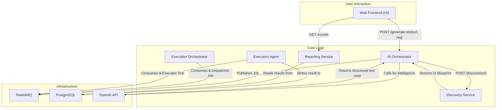

# iQAP - Intelligent Quality Assurance Platform v2.0

This repository contains the full project codebase for the **iQAP v2.0**. This version evolves the platform from a proof-of-concept into a feature-complete application by implementing our core roadmap items.

It now features a dynamic discovery service, real AI integration, persistent data storage with a reporting API, and an enhanced user interface to view results.

## New Features in v2.0

*   **Real LLM Integration:** Connects to **OpenAI's API** to generate test cases dynamically based on real-time context. The mocked response is gone.
*   **Live Discovery Service:** A new microservice that can **crawl any target URL** in real-time to generate a "UI Blueprint," which is then fed to the AI for context-aware test generation.
*   **PostgreSQL Database Persistence:** A new **Reporting Service** and updated **Execution Agent** work together to save every test run result (Pass/Fail, timestamp, objective) to a PostgreSQL database.
*   **Enhanced Frontend:** The UI now features a results table that displays the history of all test runs, allowing users to see the outcome of their generated tests.

## Architecture Diagram (v2.0)

The architecture is now more sophisticated, with dedicated services for discovery and reporting.


*(**Note:** You will need to generate this new SVG/PNG image using the updated Mermaid code below and place it in your `docs` folder.)*



## Project Structure (v2.0)

Note the addition of the `discovery-service` and `reporting-service`.

```iQAP-v2.0/
├── .env                          # Environment variables (NOW INCLUDES OPENAI_API_KEY)
├── docker-compose.yml            # Updated orchestration file
├── docs/
│   └── iqap-architecture-v2.svg
├── frontend/
│   └── ... (App.js and App.css are updated)
└── services/
    ├── ai-orchestrator/
    │   └── ... (main.py is updated)
    ├── discovery-service/          # NEW SERVICE
    │   ├── Dockerfile
    │   ├── requirements.txt
    │   └── main.py
    ├── execution-orchestrator/
    │   └── ... (no changes)
    ├── execution-agent/
    │   └── ... (agent.py is updated)
    └── reporting-service/          # NEW SERVICE
        ├── Dockerfile
        ├── requirements.txt
        └── main.py
```

## Prerequisites

*   [Docker](https://www.docker.com/products/docker-desktop/) installed and running.
*   An **OpenAI API Key**. You can get one from [platform.openai.com](https://platform.openai.com/).

## Setup & Running Instructions

### Step 1: Update the `.env` Configuration File
Your `.env` file now requires your OpenAI API key.

```ini
# PostgreSQL Configuration
POSTGRES_DB=iqap_db
POSTGRES_USER=iqap_user
POSTGRES_PASSWORD=iqap_password

# RabbitMQ Configuration
RABBITMQ_DEFAULT_USER=rabbit_user
RABBITMQ_DEFAULT_PASS=rabbit_password

# OpenAI API Key - REPLACE WITH YOUR KEY
OPENAI_API_KEY="sk-..."
```
**Important:** Paste your actual secret key where it says `"sk-..."`.

### Step 2: Build and Run the Platform
Open a terminal in the root `iQAP-v2.0/` directory and run the following command to build all the new and updated services.

```bash
docker-compose up --build -d
```

### Step 3: Check Container Status
Confirm all services, including the new `discovery-service` and `reporting-service`, are running:

```bash
docker-compose ps
```

## How to Use the v2.0 Platform

The user experience is now much richer.

*   **Step 1: Navigate to the UI**
    *   Open your web browser to: **`http://localhost:3000`**
    *   You will see a new input field for the Target URL and a table showing test results.

*   **Step 2: Generate a Real Test Case**
    *   Leave the default Target URL as `https://www.saucedemo.com`.
    *   Click the **"Generate & Run Test"** button.
    *   This will trigger the full architectural flow: the Discovery Service will crawl the URL, the AI Orchestrator will call the real OpenAI API with that context, and the job will be published to RabbitMQ.

*   **Step 3: Observe the Outcome**
    *   The test will be executed in the background by the Execution Agent.
    *   Click the **"Refresh Results"** button on the UI. You will see a new entry appear at the top of the table with the status of the test run (e.g., "PASS" or "FAIL").

This completes the end-to-end vision of the iQAP platform!