# iQAP - Intelligent Quality Assurance Platform

Welcome to iQAP. This project is now a powerful demonstration of how AI can be holistically integrated into the QA lifecycle, moving beyond simple test generation to include visual validation, intelligent self-healing, and dynamic data parameterization.

## New Features

1.  **Google Gemini Integration:** The AI core has been upgraded from OpenAI to **Google's Gemini Pro API**, leveraging its advanced reasoning for more accurate and context-aware test case generation.

2.  **Visual Regression Testing:** The platform can now detect visual bugs. The Execution Agent takes screenshots, compares them against approved baselines stored in **MinIO Object Storage**, and reports any visual discrepancies.

3.  **Enhanced Self-Healing Engine:** The self-healing logic is no longer hardcoded. When a primary UI locator fails, the agent now intelligently queries the full **UI Blueprint** (from the Discovery Service) to find the element based on other attributes, making it dramatically more resilient.

4.  **AI-Driven Test Data Parameterization:** We have moved beyond static test data. The Gemini model now generates multiple data sets for a single test case (e.g., a valid user, a locked-out user), and the Execution Agent automatically runs the test multiple times with these different parameters.

5.  **CI/CD Webhook Integration:** A new API endpoint (`/webhook/run-suite`) has been added to the AI Orchestrator, allowing external systems like **Jenkins or GitHub Actions** to trigger test runs automatically, enabling true continuous testing.

## Architecture Diagram

The architecture now incorporates MinIO for object storage and highlights the new webhook integration path.



## Project Structure


```
iQAP/
├── .env
├── docker-compose.yml
├── docs/
│   └── iqap-architecture.svg
├── frontend/
│   └── ... 
└── services/
    ├── ai-orchestrator/
    │   └── ... 
    ├── discovery-service/
    │   └── ... 
    ├── execution-orchestrator/
    │   └── ... 
    ├── execution-agent/
    │   └── ... 
    └── reporting-service/
        └── ... 
```

## Prerequisites

*   [Docker](https://www.docker.com/products/docker-desktop/) installed and running.
*   A **Google Gemini API Key**.

## Setup & Running Instructions

### Step 1: Update the `.env` Configuration File
Place your Google API key and credentials for MinIO service.

```ini
# PostgreSQL Configuration
POSTGRES_DB=iqap_db
POSTGRES_USER=iqap_user
POSTGRES_PASSWORD=iqap_password

# RabbitMQ Configuration
RABBITMQ_DEFAULT_USER=rabbit_user
RABBITMQ_DEFAULT_PASS=rabbit_password

# Google Gemini API Key - REPLACE WITH YOUR KEY
GOOGLE_API_KEY="google_api_key_here"

# MinIO Object Storage Configuration
MINIO_ROOT_USER=minioadmin
MINIO_ROOT_PASSWORD=minioadmin
```

### Step 2: Build and Run the Platform
Open a terminal in the root `iQAP/` directory and run the following command to build all services.

```bash
docker-compose up --build -d
```

### Step 3: Create the MinIO Bucket
After the services start, create a "bucket" in MinIO to store the visual regression screenshots.

*   Open your browser to the MinIO console: **`http://localhost:9001`**
*   Login with the credentials from `.env` file (`minioadmin` / `minioadmin`).
*   Click the "Create Bucket" button.
*   Name the bucket **`visual-baselines`** and click "Create Bucket".

## How to Use the iQAP Platform

*   **Generate a Test:** Go to **`http://localhost:3000`**. Use the UI to generate a test for `https://www.saucedemo.com`.
*   **Observe the Flow:** The test will run in the background. Check the `docker-compose logs -f execution-agent` to see its progress. The first time it runs, it will save a "baseline" screenshot.
*   **View Results:** Click "Refresh Results" on the UI to see the outcome saved in the database.

## (Future Roadmap)

1.  **Cloud-Based Cross-Browser Execution:** Integration with a cloud grid provider (like BrowserStack or Sauce Labs) to run tests across dozens of real browsers and devices in parallel.
2.  **AI-Powered Exploratory Testing:** "explore" mode where the AI is given a URL and autonomously navigates the application, trying to find crashes and bugs without a pre-written script.
3.  **API Test Generation:** Extending the Discovery Service to ingest OpenAPI/Swagger specifications and have Gemini automatically generate a full suite of API contract and integration tests.
4.  **User Session Recording to Test Script:** Building a browser extension to record a manual testing session (clicks, typing) and have the AI automatically convert it into a robust, repeatable iQAP test script.
5.  **Jira & Slack Integration:** Automatically creating detailed Jira tickets for test failures (with videos/screenshots attached) and post notifications to a MSTeams channel.
6.  **Performance Baseline Testing:** Enhancing the Execution Agent to capture key performance metrics (like Page Load Time, Largest Contentful Paint) and automatically fail a test if it regresses beyond a set threshold.
7.  **AI-Powered Test Suite Optimization:** Building a module that analyzes test results over time and uses AI to identify redundant or low-value tests that can be safely removed, keeping the suite fast and efficient.
8.  **Predictive Defect Analysis:** Using machine learning to analyze code commit history and past test failures to create a "heat map" that predicts which parts of the application are most likely to have bugs in the future.
9.  **Automated Accessibility (a11y) Auditing:** Integrating tools like Axe-Core into the Execution Agent to automatically scan for and report on WCAG accessibility violations.
10. **Enhanced Reporting and Analytics:** Building a more advanced dashboard in the frontend with trend charts, failure rate analysis, and visual test "diff" viewers.