# iQAP - Intelligent Quality Assurance Platform v1.0

This repository contains the full project codebase for the **iQAP v1.0**, an enterprise-ready platform designed to make software quality assurance autonomous and intelligent.

This project moves beyond the PoC by implementing a complete microservices architecture with persistent data storage, asynchronous job processing, and a scalable execution model. It serves as a robust foundation for building a production-grade internal tool.

## Core Architectural Features

*   **Asynchronous & Decoupled:** Services are fully decoupled using a **RabbitMQ** message queue. The AI service can publish thousands of test jobs without waiting for them to be executed, ensuring high throughput and resilience.
*   **Persistent Data Storage:** A **PostgreSQL** database is integrated to store all projects, requirements, generated test cases, and execution results for future analysis and reporting.
*   **Scalable Execution Model:** A dedicated **Execution Orchestrator** manages the queue of waiting test jobs. This design allows for scaling the number of **Execution Agents** to run hundreds of tests in parallel.
*   **Model-Context Protocol (MCP) Simulation:** The AI Orchestrator is built around the MCP pattern for reliable, structured interactions with AI models. The response is currently mocked but the framework is in place.
*   **Technology Agnostic ("Plug and Play"):** The platform remains completely independent of the target application's tech stack, interacting only through the browser layer just like a real user.

## Architecture Diagram (v1.0)

This diagram shows the asynchronous flow of data through the system's core components. The user interacts with the UI, which triggers the AI Orchestrator. The job is then passed through the RabbitMQ message queue to be picked up by the Execution Orchestrator and finally run by an Agent.



*   **1. POST /generate-test:** The user initiates a request from the **Web Frontend**.
*   **2. Publishes 'Generation Job':** The **AI Orchestrator** creates a job and publishes it to the **RabbitMQ** queue.
*   **3. Consumes job:** The **Execution Orchestrator** is listening to the queue and picks up the new job.
*   **4. Dispatches 'Execution Job':** The Orchestrator forwards the job to a specific queue for the agents.
*   **5. Consumes job:** An available **Execution Agent** picks up the job from the execution queue.
*   **6. Executes test & saves results:** The Agent runs the test and, upon completion, would save the results to the **PostgreSQL** database.


## Project Structure

```iQAP-v1.0/
├── .env                          # Environment variables for all services
├── docker-compose.yml            # The master file to run all services
│
├── docs/                         # Contains documentation assets
│   └── iqap-architecture-v1.svg  # The architecture diagram image
│
├── frontend/                     # The user interface (React)
│   ├── Dockerfile
│   ├── package.json
│   ├── public/
│   │   ├── index.html
│   │   └── manifest.json
│   └── src/
│       ├── App.css
│       ├── App.js
│       └── index.js
│
└── services/                     # All backend microservices
    ├── ai-orchestrator/          # The MCP Brain (Python/FastAPI)
    │   ├── Dockerfile
    │   ├── requirements.txt
    │   └── app/
    │       └── main.py
    │
    ├── execution-orchestrator/   # The Job Manager (Python/Pika)
    │   ├── Dockerfile
    │   ├── requirements.txt
    │   └── orchestrator.py
    │
    └── execution-agent/          # The Test Runner (Python/Playwright)
        ├── Dockerfile
        ├── requirements.txt
        └── agent.py
```

## Prerequisites

*   [Docker](https://www.docker.com/products/docker-desktop/) installed and running on your machine.

## Setup & Running Instructions

This is a step-by-step guide to get the entire platform running locally.

### Step 1: Create the `.env` Configuration File
At the root of the project (`iQAP-v1.0/`), create a file named `.env`. Copy and paste the following content into it. These default values are configured to work seamlessly with our `docker-compose.yml`.

```ini
# PostgreSQL Configuration
POSTGRES_DB=iqap_db
POSTGRES_USER=iqap_user
POSTGRES_PASSWORD=iqap_password

# RabbitMQ Configuration
RABBITMQ_DEFAULT_USER=rabbit_user
RABBITMQ_DEFAULT_PASS=rabbit_password
```

### Step 2: Build and Run the Platform
Open a terminal in the root `iQAP-v1.0/` directory and run the following command. The `-d` flag is recommended to run all services in the background.

```bash
docker-compose up --build -d
```
This command will build the Docker images for all services and start the entire stack, including PostgreSQL and RabbitMQ.

### Step 3: Check Container Status (Optional but Recommended)
To confirm all services are running correctly, use the command:

```bash
docker-compose ps
```
You should see all services (`frontend`, `ai-orchestrator`, `execution-orchestrator`, `execution-agent`, `postgres`, `rabbitmq`) in the `Up` or `Running` state.

## How to Use the Platform (The User Flow)

The flow is now asynchronous, which is how a real-world, scalable system operates.

#### **Action 1: Generate a Test Case**

*   Open your web browser and navigate to: **`http://localhost:3000`**
*   Click the **"Generate Test Case"** button on the web page.
*   You will see an almost instant response in the UI, like `"message": "Test Case Generation Job Published!"`. This is correct! The AI service's only job is to validate the request and publish it to the **RabbitMQ** message queue. It doesn't wait for the test to run.

#### **Action 2: Observe the Asynchronous Flow**

*   To "see" the rest of the flow happening in the background, you need to watch the logs of the backend services.
*   In your terminal, run this command to follow the logs of the key services:

    ```bash
    docker-compose logs -f execution-orchestrator execution-agent
    ```
*   You will see the following sequence of events:
    1.  The **`execution-orchestrator`** will log a message like `[x] Orchestrator received job...`
    2.  It will then immediately log `[>] Orchestrator dispatched job...`
    3.  Seconds later, the **`execution-agent`** will log `[x] Execution Agent received job...` and will begin the Playwright test run, printing its progress to the console.

This demonstrates a true, decoupled, and scalable system architecture ready for future enhancements.

## Future Roadmap (Next Steps)

This v1.0 codebase is a foundation. The next logical steps are:
1.  **Integrate a Real LLM:** Replace the mocked AI response in the `ai-orchestrator` with a real API call to a provider like OpenAI or Google Vertex AI.
2.  **Implement the Discovery Service:** Build the service that can crawl a target URL and generate the UI blueprint dynamically.
3.  **Connect to PostgreSQL:** Have the `execution-agent` write its final results (Pass/Fail, duration, artifacts) to the `postgres` database.
4.  **Enhance the Frontend:** Build out the frontend to show a real-time dashboard of test results by polling a new `Reporting Service`.